# **Đồ án cuối kì môn Lập trình Khoa học Dữ liệu**

Người thực hiện: Nhóm 9

- [Nguyễn Văn Quang Hưng] 21120247
- [Huỳnh Trí Nhân] 21120302
- [Chiêm Bỉnh Nguyên] 21120298

## Giới thiệu đồ án

## Môi trường sử dụng

- Ngôn ngữ Python >= 3.9
- Editor: Visual Studio Code, Jupyter Notebook
- Tổ chức file:
  - `data`: chứa dữ liệu thu thập được và dữ liệu sau khi tiền xử lý
  - `notebooks`: chứa các file mã nguồn theo từng giai đoạn của đồ án
    - 1.0-data-collecting.ipynb: file thu thập dữ liệu
    - 2.0-data-preprocessing.ipynb: file tiền xử lý dữ liệu
    - 3.0-data_explorating.ipynb: file khám phá dữ liệu
    - 4.0-questions-and-answers.ipynb: file đặt câu hỏi và trả lời
    - 5.0-member-reflection.ipynb: file tự nhận xét
  - `images`: chứa các hình ảnh minh họa
  - `README.md`: file hướng dẫn sử dụng

## Chi tiết thực hiện

### 1. Thu thập dữ liệu

- Nguồn dữ liệu thu thập từ trang web [Kaggle](https://www.kaggle.com/datasets/catherinerasgaitis/mxmh-survey-results)

  - Trong phần này, nhóm sử dụng chọn bộ dữ liệu Music & Mental Health Survey Results. Một bộ dữ liệu khảo sát dựa trên sở thích âm nhạc và tự đánh giá sức khỏe tinh thần của người tham gia.

- Link: `https://www.kaggle.com/datasets/catherinerasgaitis/mxmh-survey-results`
- Nhóm tải bộ dữ liệu về và thu được một bộ dữ liệu gồm 736 mẫu với 33 cột thuộc tính.

### 2. Tiền xử lý dữ liệu

- Trong khoa học dữ liệu tiền xử lý dữ liệu quan trọng bởi vì những lý do sau:
  - Cải thiện Chất lượng Dữ liệu: Dữ liệu thô thường chứa nhiều lỗi như giá trị thiếu, không nhất quán, hoặc nhiễu. Tiền xử lý giúp làm sạch và chuẩn hóa dữ liệu, đảm bảo tính chính xác và đáng tin cậy cho phân tích.
  - Phát hiện và Xử lý Dữ liệu Ngoại lai: Dữ liệu ngoại lai có thể gây ra những hiểu lầm trong quá trình phân tích. Tiền xử lý giúp xác định và xử lý chúng một cách phù hợp.
  - Chuẩn hóa và Chuyển đổi Dữ liệu: Điều này bao gồm việc chuyển đổi dữ liệu sang các định dạng thích hợp hoặc chuẩn hóa các đặc trưng để chúng có thể được so sánh và phân tích một cách công bằng.
  - Giảm Kích thước và Tính phức tạp: Tiền xử lý có thể giúp giảm kích thước dữ liệu bằng cách loại bỏ các đặc trưng không quan trọng hoặc thông tin dư thừa, giúp quá trình học máy hiệu quả hơn.
  - Tăng cường Hiểu biết về Dữ liệu: Quá trình này cũng giúp các nhà khoa học dữ liệu hiểu rõ hơn về bản chất của dữ liệu, qua đó đưa ra những quyết định phân tích chính xác hơn.
- Các bước tiền xử lý dữ liệu là:

  - Làm sạch dữ liệu ( Data cleaning): Thường chúng ta sẽ Xử lý giá trị bị thiếu (Missing value) và loại bỏ các giá trị ngoại lai (Outlier) trong dữ liệu.
  - Chuẩn hóa và biến đổi dữ liệu (Data transformatrion): Đưa các giá trị về đúng kiểu dữ liệu, xác định biến số và biến phân loại của dữ liệu.

    2.1. Xóa những cột không cần thiết: Một số cột dữ liệu không có nhiều giá trị trong quá trình phân tích của nhóm sẽ được loại bỏ.

  - Một số cột bị loại bỏ là : `'Timestamp', 'Permissions'.`

    2.2. Xử lý dữ liệu theo cột

  - Nhóm sẽ tiến hành đưa các cột điểm đánh giá mức độ nghiêm trọng của các triệu chứng, số giờ nghe nhạc về kiểu int.

  => Sau đó kiểm tra dữ liệu trùng lặp và xóa nó đi.

  2.3. Xử lý dữ liệu nhiễu và thiếu

- Kiểm tra dữ liệu bị thiếu

  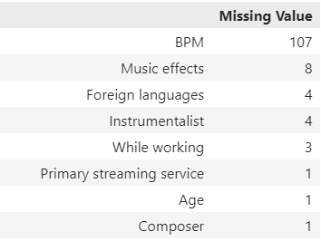

- Có các cột trên bị thiếu dữ liệu nhưng đa phần (trừ cột BPM) thì số lượng dữ liệu thiếu là không nhiều nên nhóm quyết định sẽ xóa các dòng dữ liệu bị thiếu này đi.
- Riêng cột BPM, có nhiều cách để xử lí dữ liệu thiếu nhưng trong đồ án này nhóm quyết định sẽ sử dụng thuật toán KNN để điền khuyết.

- Để có thể tiến hành áp dụng KNN thì trước tiên nhóm sẽ xử lí những dữ liệu outlier. Bởi vì các giá trị này gây ảnh hưởng tiêu cực đến kết quả. Nhóm quyết định sử dụng IQR để tìm ra các giá trị outlier của cột BPM

- Những dữ liệu outlier như 99999999.0, 624.0, 0 gây tác động rất tiêu cực đến kết quả của KNN. Vì BPM của một bài hát chỉ nằm trong khoảng 24-220 BPM. Trong trường hợp này bởi vì tiếp theo nhóm chúng em sẽ điền khuyết bằng KNN nên tạm thời chuyển những giá trị này thành np.nan và đưa vào mô hình.

=> Cuối cùng nhóm sẽ tiến hành xử lí dữ liệu nhiễu ở một số cột khác.

2.4. Xử lý dữ liệu nhiễu

- Xử lý nhiễu (noise) trong dữ liệu là một phần quan trọng của quá trình tiền xử lý trong khoa học dữ liệu. Nhiễu có thể làm giảm chất lượng dữ liệu để phân tích và đánh giá, vì vậy việc xác định và xử lý nhiễu là cần thiết.

- Ở phần này nhóm em sẽ sử dụng IQR để chủ yếu xử lí trên hai cột là `'BPM'` và `'Hours per day'`

- Sau khi xử lí outlier nhóm thu được bộ dữ liệu hoàn chỉnh với 666 mẫu và 31 cột

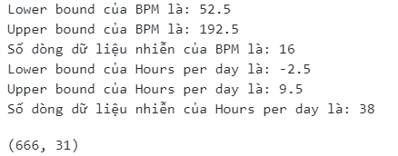

#### Sau khi tiến hành tiền xử lí dữ liệu nhóm thu được bộ dữ liệu như sau

- Xét các cột dữ liệu số

  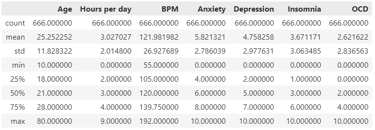

- Xét các cột dữ liệu phân loại

  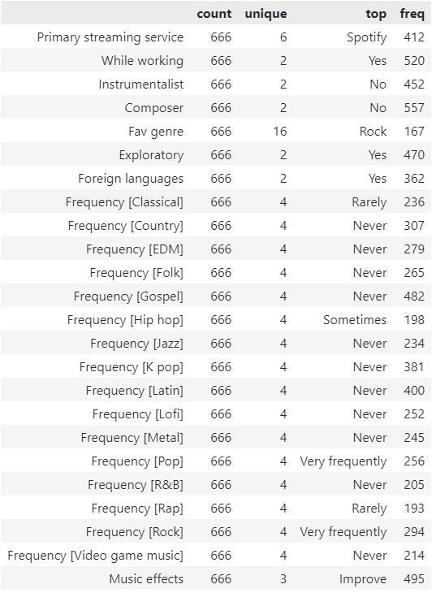

### 3. Khám phá dữ liệu

Nhóm thống kê dữ liệu theo từng cột, để tìm ra đặc trưng của cột đó, đồng thời xem xét các mối tương quan giữa các cột dữ liệu để có những cái nhìn trực quan nhất, và hiểu rõ nhất về dữ liệu.

#### 3.1 Thống kê về tuổi

<table border="1" class="dataframe">
  <thead>
    <tr style="text-align: right;">
      <th></th>
      <th>Age</th>
    </tr>
  </thead>
  <tbody>
    <tr>
      <td>count</td>
      <td>666.000000</td>
    </tr>
    <tr>
      <td>mean</td>
      <td>25.252252</td>
    </tr>
    <tr>
      <td>std</td>
      <td>11.828322</td>
    </tr>
    <tr>
      <td>min</td>
      <td>10.000000</td>
    </tr>
    <tr>
      <td>25%</td>
      <td>18.000000</td>
    </tr>
    <tr>
      <td>50%</td>
      <td>21.000000</td>
    </tr>
    <tr>
      <td>75%</td>
      <td>28.000000</td>
    </tr>
    <tr>
      <td>max</td>
      <td>80.000000</td>
    </tr>
  </tbody>
</table>

Nhóm vẽ hai biểu đồ countplot và boxplot để có cái nhìn trực quan nhất về độ tuổi của các người tham gia khảo sát.

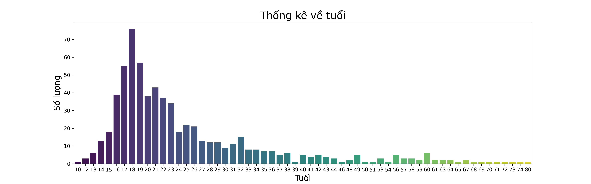

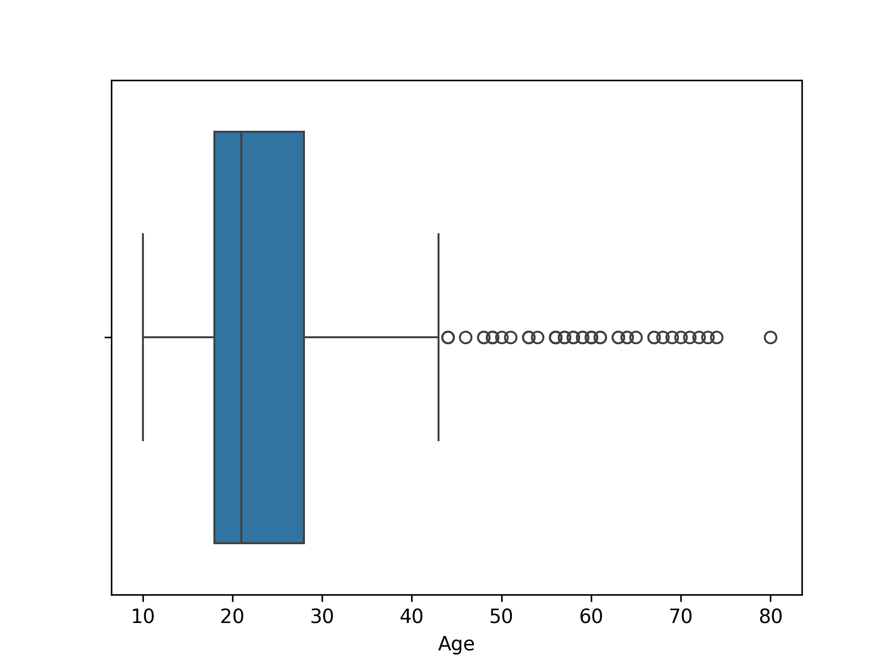

- Dựa vào biểu đồ boxplot và countplot. Chúng ta có thể thấy đa phần độ tuổi tham gia khảo sát đều ở độ tuổi từ 18 đến 28 tuổi.
- Độ tuổi thấp nhất tham gia khảo sát là 10 tuổi và cao nhất là 80 tuổi.
- Độ tuổi trung bình tham gia khảo sát là 21 - 23 tuổi.

#### 3.2 Thống kê về dịch vụ nghe nhạc

<table border="1" class="dataframe">
  <thead>
    <tr style="text-align: right;">
      <th>Dịch vụ</th>
      <th>Số lượng</th>
    </tr>
  </thead>
  <tbody>
    <tr>
      <td>Spotify</td>
      <td>412</td>
    </tr>
    <tr>
      <td>YouTube Music</td>
      <td>87</td>
    </tr>
    <tr>
      <td>I do not use a streaming service.</td>
      <td>63</td>
    </tr>
    <tr>
      <td>Apple Music</td>
      <td>47</td>
    </tr>
    <tr>
      <td>Other streaming service</td>
      <td>47</td>
    </tr>
    <tr>
      <td>Pandora</td>
      <td>10</td>
    </tr>
  </tbody>
</table>

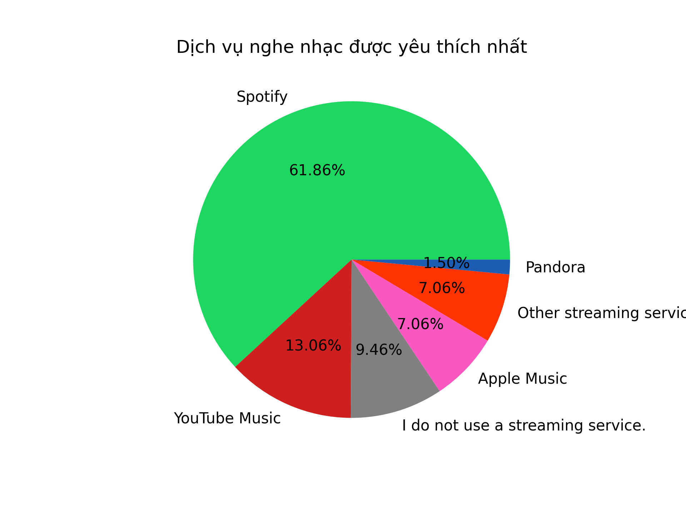

- Dịch vụ nghe nhạc của Spotify được nhiều người sử dụng nhất và chiếm phần lớn trong khảo sát với hơn 60%
- Các dịch vụ nghe nhạc còn lại không chênh lệch nhiều, chỉ có Pandora là dịch vụ được sử dụng ít nhất, chỉ khoảng 1%

**Độ tuổi nghe nhạc trên các nền tảng là gì ? Trên mỗi nền tảng độ tuổi nghe nhạc có khác nhau không?**

#### 3.3 Thống kê về số giờ nghe

<table border="1" class="dataframe">
  <thead>
    <tr style="text-align: right;">
      <th></th>
      <th>Hours per day</th>
    </tr>
  </thead>
  <tbody>
    <tr>
      <td>count</td>
      <td>666.000000</td>
    </tr>
    <tr>
      <td>mean</td>
      <td>3.027027</td>
    </tr>
    <tr>
      <td>std</td>
      <td>2.014800</td>
    </tr>
    <tr>
      <td>min</td>
      <td>0.000000</td>
    </tr>
    <tr>
      <td>25%</td>
      <td>2.000000</td>
    </tr>
    <tr>
      <td>50%</td>
      <td>3.000000</td>
    </tr>
    <tr>
      <td>75%</td>
      <td>4.000000</td>
    </tr>
    <tr>
      <td>max</td>
      <td>9.000000</td>
    </tr>
  </tbody>
</table>

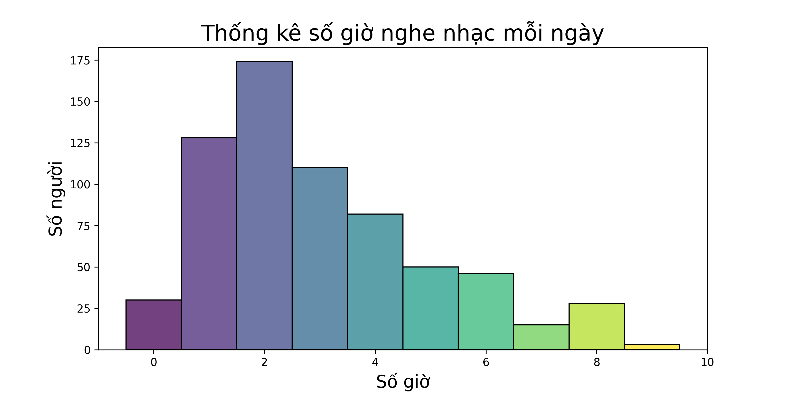

- Số giờ mà các đáp viên nghe nhạc nhiều nhất là 2 giờ, ít nhất là 9 giờ
- Số giờ có xu hướng giảm từ 3 giờ đến 9 giờ và từ 2 giờ đến 0 giờ

#### 3.4 Thống kê về thể loại âm nhạc yêu thích

<table border="1" class="dataframe">
  <thead>
    <tr style="text-align: right;">
      <th>Thể loại yêu thích</th>
      <th>Số lượng</th>
    </tr>
  </thead>
  <tbody>
    <tr>
      <td>Rock</td>
      <td>167</td>
    </tr>
    <tr>
      <td>Pop</td>
      <td>111</td>
    </tr>
    <tr>
      <td>Metal</td>
      <td>77</td>
    </tr>
    <tr>
      <td>Classical</td>
      <td>50</td>
    </tr>
    <tr>
      <td>Video game music</td>
      <td>41</td>
    </tr>
    <tr>
      <td>R&amp;B</td>
      <td>34</td>
    </tr>
    <tr>
      <td>Hip hop</td>
      <td>32</td>
    </tr>
    <tr>
      <td>EDM</td>
      <td>30</td>
    </tr>
    <tr>
      <td>Folk</td>
      <td>29</td>
    </tr>
    <tr>
      <td>Country</td>
      <td>24</td>
    </tr>
    <tr>
      <td>K pop</td>
      <td>19</td>
    </tr>
    <tr>
      <td>Rap</td>
      <td>19</td>
    </tr>
    <tr>
      <td>Jazz</td>
      <td>16</td>
    </tr>
    <tr>
      <td>Lofi</td>
      <td>10</td>
    </tr>
    <tr>
      <td>Gospel</td>
      <td>6</td>
    </tr>
    <tr>
      <td>Latin</td>
      <td>1</td>
    </tr>
  </tbody>
</table>

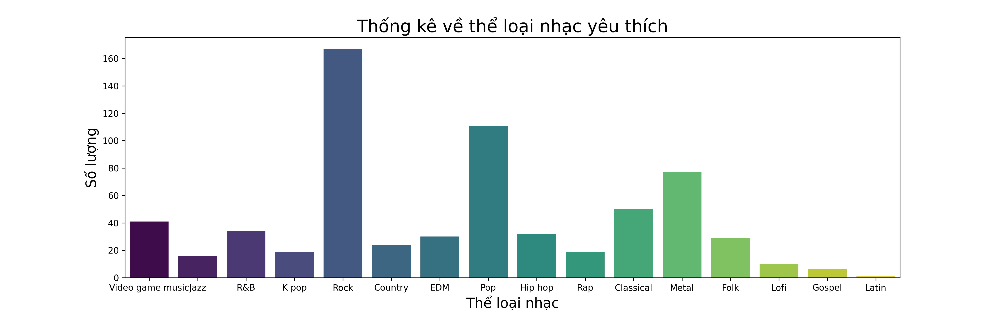

- Thể loại nhạc được yêu thích nhiều nhất là Rock, và ít nhất là Latin với Gospel

**Chúng ta tiếp tục khám phá xem thể loại nhạc yêu thích khác nhau theo độ tuổi và BPM của các thế loại đó**

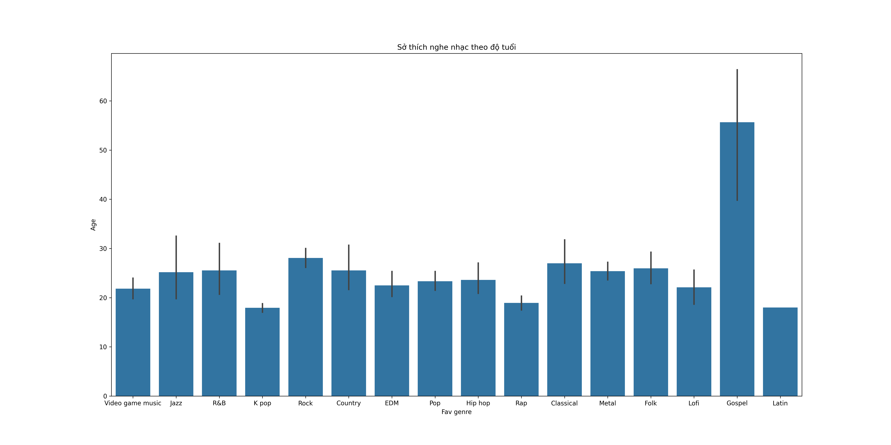

- Nhạc Kpop, Rap được các đáp viên trẻ yêu thích nhiều nhất
- Đối với các đáp viên lớn tuổi thì là nhạc Gospel
- Các thể loại nhạc còn lại không có khác biệt nhiều

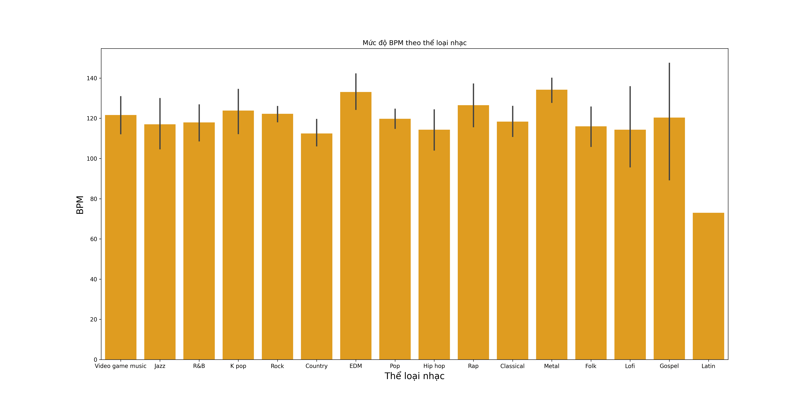

- BPM của thể loại EDM và Mental ở mức khá cao và cao nhất trong các thể loại nhạc.
- Mức BPM của Latin rất thấp, chênh lệch hoàn toàn so với phần còn lại, nhưng vì dữ liệu về thể loại Latin chỉ có 1 nên chúng ta sẽ tạm thời bỏ qua dòng nhạc này.
- Mức BPM trung bình thấp nhất là của thể loại Country.

#### 3.5 Khám phá các cột Yes/No

<table border="1" class="dataframe">
  <thead>
    <tr style="text-align: right;">
      <th></th>
      <th>While working</th>
      <th>Composer</th>
      <th>Instrumentalist</th>
      <th>Exploratory</th>
      <th>Foreign languages</th>
    </tr>
  </thead>
  <tbody>
    <tr>
      <th>No</th>
      <td>146</td>
      <td>557</td>
      <td>452</td>
      <td>196</td>
      <td>304</td>
    </tr>
    <tr>
      <th>Yes</th>
      <td>520</td>
      <td>109</td>
      <td>214</td>
      <td>470</td>
      <td>362</td>
    </tr>
  </tbody>
</table>

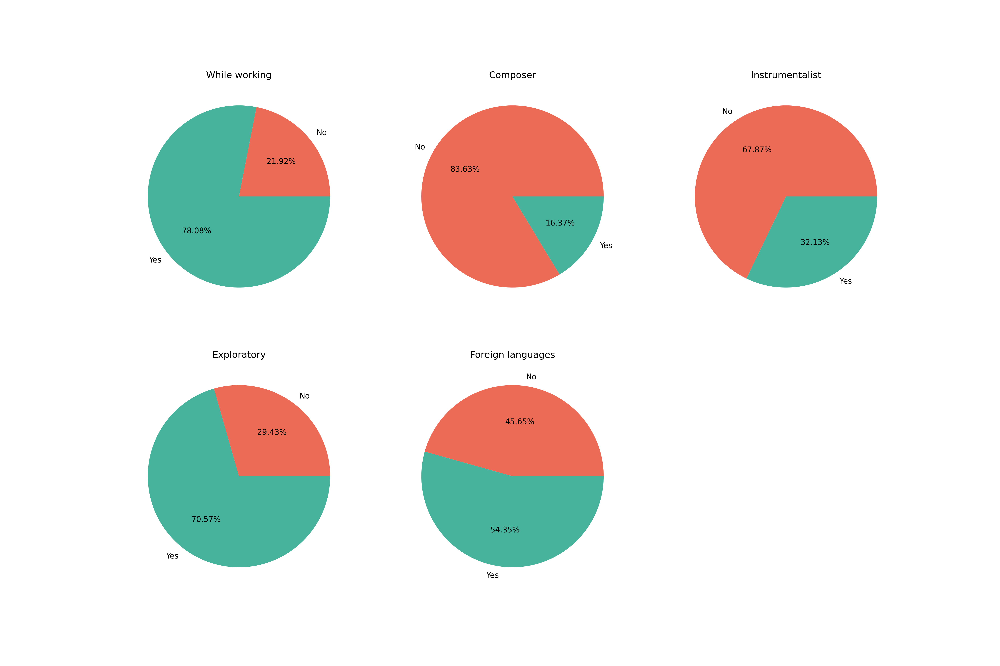

- Hơn 78% người tham gia khảo sát nghe nhạc lúc đang làm việc
- Hầu hết mọi người chưa bao giờ sáng tạc nhạc, với hơn 83% chọn No
- Khoảng 32% đã từng chơi nhạc cụ gần đây
- Khoảng 70% mọi người có xu hướng khám phá thêm các tác giả và thể loại nhạc mới
- Số lượng người có nghe nhạc nước ngoài tương đương với người không nghe, 46 so với 54%

#### 3.6 Tần suất nghe của từng thể loại nhạc

<table border="1" class="dataframe">
  <thead>
    <tr style="text-align: right;">
      <th></th>
      <th>Never</th>
      <th>Rarely</th>
      <th>Sometimes</th>
      <th>Very frequently</th>
    </tr>
  </thead>
  <tbody>
    <tr>
      <th>Classical</th>
      <td>149</td>
      <td>236</td>
      <td>179</td>
      <td>102</td>
    </tr>
    <tr>
      <th>Country</th>
      <td>307</td>
      <td>214</td>
      <td>99</td>
      <td>46</td>
    </tr>
    <tr>
      <th>EDM</th>
      <td>279</td>
      <td>177</td>
      <td>132</td>
      <td>78</td>
    </tr>
    <tr>
      <th>Folk</th>
      <td>265</td>
      <td>200</td>
      <td>133</td>
      <td>68</td>
    </tr>
    <tr>
      <th>Gospel</th>
      <td>482</td>
      <td>123</td>
      <td>47</td>
      <td>14</td>
    </tr>
  </tbody>
</table>

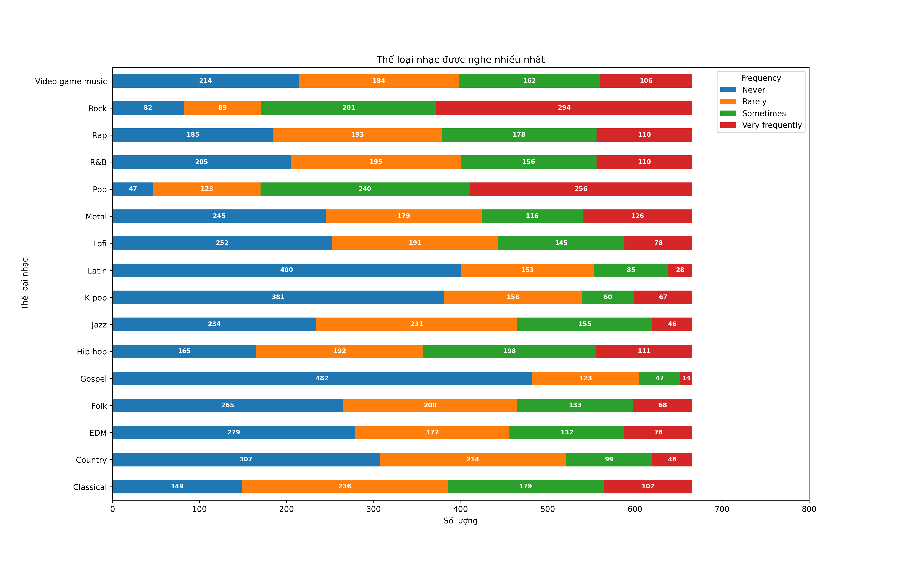

- Nhạc Rock là nhạc có số lượng nghe thường xuyên nhiều nhất, ít nhất là Gospel
- Nhạc Gospel là nhạc có số người chưa bao giờ nghe là nhiều nhất, với nhạc Pop thì hầu như là ai cũng đã từng nghe

#### 3.7 Việc nghe nhạc có cải thiện sức khoẻ tinh thần không ?

<table border="1" class="dataframe">
  <thead>
    <tr style="text-align: right;">
      <th>Ảnh hưởng</th>
      <th>Số lượng</th>
    </tr>
  </thead>
  <tbody>
    <tr>
      <td>Improve</td>
      <td>495</td>
    </tr>
    <tr>
      <td>No effect</td>
      <td>155</td>
    </tr>
    <tr>
      <td>Worsen</td>
      <td>16</td>
    </tr>
  </tbody>
</table>

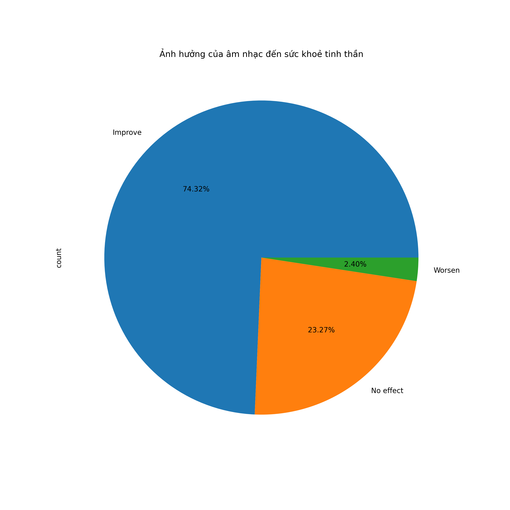

- Gần 3/4 số người tham gia khảo sát cho rằng việc nghe nhạc cải thiện được sức khoẻ tinh thần của họ
- Khoảng 23% cho biết rằng nghe nhạc không ảnh hưởng gì
- Và Có 2.43% những người tham gia khảo sát cảm thấy việc nghe nhạc đã làm cho tình trạng của họ tệ hơn

#### 3.8 Mức độ bệnh của những người tham gia khảo sát

<table border="1" class="dataframe">
  <thead>
    <tr style="text-align: right;">
      <th>Mức độ</th>
      <th>OCD</th>
      <th>Anxiety</th>
      <th>Depression</th>
      <th>Insomnia</th>
    </tr>
  </thead>
  <tbody>
    <tr>
      <th>0</th>
      <td>223</td>
      <td>30</td>
      <td>74</td>
      <td>137</td>
    </tr>
    <tr>
      <th>1</th>
      <td>88</td>
      <td>28</td>
      <td>38</td>
      <td>78</td>
    </tr>
    <tr>
      <th>2</th>
      <td>88</td>
      <td>42</td>
      <td>83</td>
      <td>79</td>
    </tr>
    <tr>
      <th>3</th>
      <td>59</td>
      <td>62</td>
      <td>54</td>
      <td>62</td>
    </tr>
    <tr>
      <th>4</th>
      <td>46</td>
      <td>48</td>
      <td>56</td>
      <td>56</td>
    </tr>
    <tr>
      <th>5</th>
      <td>46</td>
      <td>53</td>
      <td>54</td>
      <td>48</td>
    </tr>
    <tr>
      <th>6</th>
      <td>30</td>
      <td>81</td>
      <td>80</td>
      <td>55</td>
    </tr>
    <tr>
      <th>7</th>
      <td>29</td>
      <td>109</td>
      <td>88</td>
      <td>56</td>
    </tr>
    <tr>
      <th>8</th>
      <td>24</td>
      <td>105</td>
      <td>72</td>
      <td>46</td>
    </tr>
    <tr>
      <th>9</th>
      <td>14</td>
      <td>47</td>
      <td>33</td>
      <td>21</td>
    </tr>
    <tr>
      <th>10</th>
      <td>19</td>
      <td>61</td>
      <td>34</td>
      <td>28</td>
    </tr>
  </tbody>
</table>

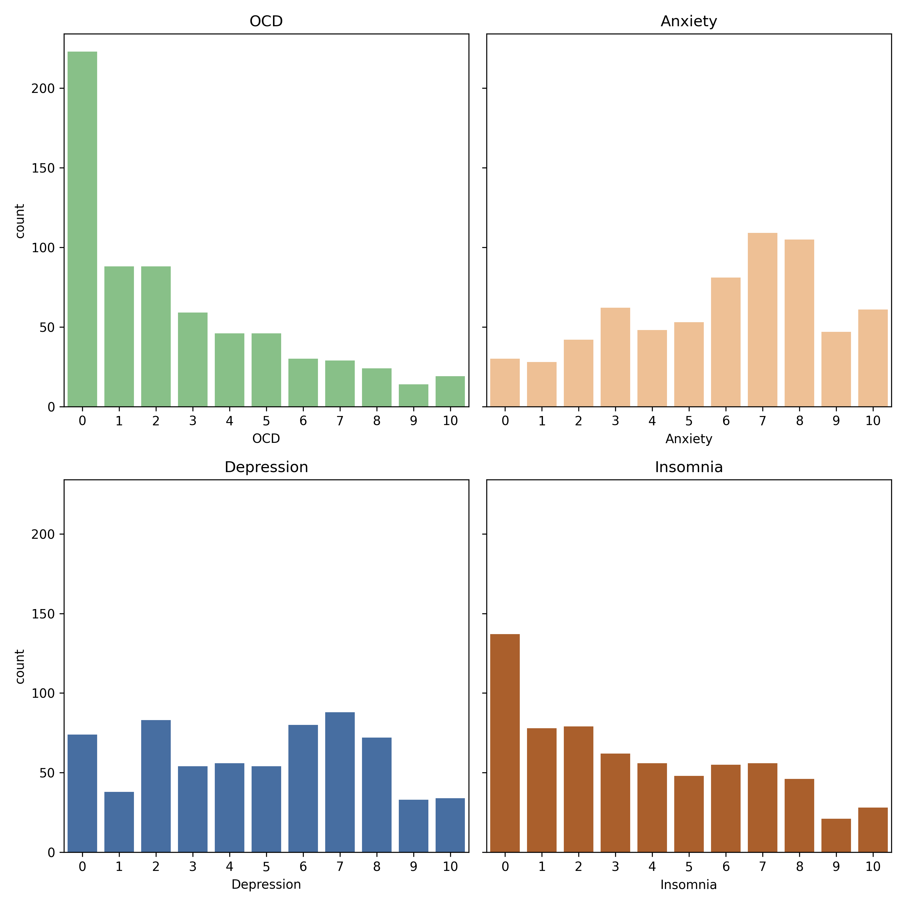

- Hầu hết mọi người đều không bị OCD, bị Mất ngủ ở mức nhẹ, và Lo lắng ở mức khá cao
- Mức độ trầm cảm được trải đều, cao nhất là ở mức 7

#### 3.9 Độ tương quan giữa các cột numeric(cột số)

<table border="1" class="dataframe">
  <thead>
    <tr style="text-align: right;">
      <th></th>
      <th>Age</th>
      <th>Hours per day</th>
      <th>BPM</th>
      <th>Anxiety</th>
      <th>Depression</th>
      <th>Insomnia</th>
      <th>OCD</th>
    </tr>
  </thead>
  <tbody>
    <tr>
      <th>Age</th>
      <td>1.000000</td>
      <td>-0.080485</td>
      <td>-0.023908</td>
      <td>-0.169020</td>
      <td>-0.104194</td>
      <td>0.032421</td>
      <td>-0.124796</td>
    </tr>
    <tr>
      <th>Hours per day</th>
      <td>-0.080485</td>
      <td>1.000000</td>
      <td>-0.045530</td>
      <td>0.068906</td>
      <td>0.089070</td>
      <td>0.135926</td>
      <td>0.122564</td>
    </tr>
    <tr>
      <th>BPM</th>
      <td>-0.023908</td>
      <td>-0.045530</td>
      <td>1.000000</td>
      <td>0.086288</td>
      <td>0.066337</td>
      <td>0.065990</td>
      <td>-0.008496</td>
    </tr>
    <tr>
      <th>Anxiety</th>
      <td>-0.169020</td>
      <td>0.068906</td>
      <td>0.086288</td>
      <td>1.000000</td>
      <td>0.510855</td>
      <td>0.287339</td>
      <td>0.341362</td>
    </tr>
    <tr>
      <th>Depression</th>
      <td>-0.104194</td>
      <td>0.089070</td>
      <td>0.066337</td>
      <td>0.510855</td>
      <td>1.000000</td>
      <td>0.366144</td>
      <td>0.177163</td>
    </tr>
    <tr>
      <th>Insomnia</th>
      <td>0.032421</td>
      <td>0.135926</td>
      <td>0.065990</td>
      <td>0.287339</td>
      <td>0.366144</td>
      <td>1.000000</td>
      <td>0.236582</td>
    </tr>
    <tr>
      <th>OCD</th>
      <td>-0.124796</td>
      <td>0.122564</td>
      <td>-0.008496</td>
      <td>0.341362</td>
      <td>0.177163</td>
      <td>0.236582</td>
      <td>1.000000</td>
    </tr>
  </tbody>
</table>

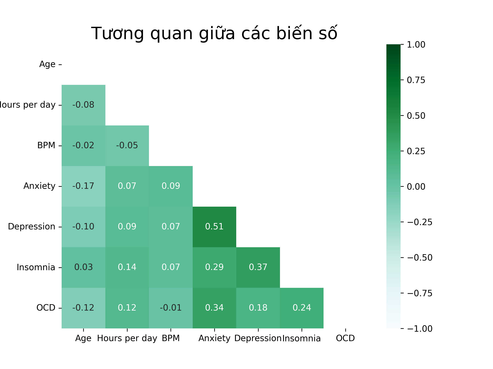

Dường như các cột số trong dữ liệu không có sự tương quan nào với nhau, chỉ số tương quan cao nhất là 0.51, và các chỉ số còn lại luôn rất thấp

### 4. Đặt câu hỏi về bộ dữ liệu và trả lời

  

    
<b>Câu 1:  Vấn đề về sức khỏe tinh thần của những người tham gia như thế nào ? Vấn đề này có đáng lo ngại không?  </b>

<b>Câu hỏi có lợi ích gì: </b> Bộ dữ liệu nghiên cứu về sự tác động của âm nhạc đến với những vấn đề sức khỏe tâm lý như: Lo lắng, trầm cảm, mất ngủ và rồi loạn cưỡng chế. Do việc xem những vấn đế này có tác động đến những người tham gia là điều đáng quan tâm. Liệu những vấn đề này có tiềm tàng trong chúng ta hay không và với tỉ lệ như thế nào? Nếu lớn quá thì có đáng tâm hay không? 

<b>Cách trả lời câu hỏi: </b>

- Có 4 bước:

  - _Bước 1_: Xem xét sự phân bố của từng loại triệu chứng tâm lý trong từng loại bệnh.

  - _Bước 2_: Đánh giá mức độ nghiêm trọng của các triệu chứng này.

  - _Bước 3_: Vẽ biểu đồ venn thể hiện sự giao nhau của các triệu chứng

  - _Bước 4_: Đánh giá khả năng một người có thể mắc nhiều triệu chứng cùng một lúc

<b>Kết quả các bước làm: </b>Biểu đồ Venn thể hiện mối liên hệ giữa các triệu chứng

<b>Bước 1: Xem xét sự phân bố của từng loại triệu chứng tâm lý trong từng loại bệnh</b> :
  

<caption><b>Điểm trung bình các triệu chứng</b></caption>

<table border="1" class="dataframe">
  <thead>
    <tr style="text-align: right;">
      <th></th>
      <th>Triệu chứng</th>
      <th>Điểm</th>
    </tr>
  </thead>
  <tbody>
    <tr>
      <th>0</th>
      <td>Anxiety</td>
      <td>5.821321</td>
    </tr>
    <tr>
      <th>1</th>
      <td>Depression</td>
      <td>4.758258</td>
    </tr>
    <tr>
      <th>2</th>
      <td>Insomnia</td>
      <td>3.671171</td>
    </tr>
    <tr>
      <th>3</th>
      <td>OCD</td>
      <td>2.621622</td>
    </tr>
  </tbody>
</table>

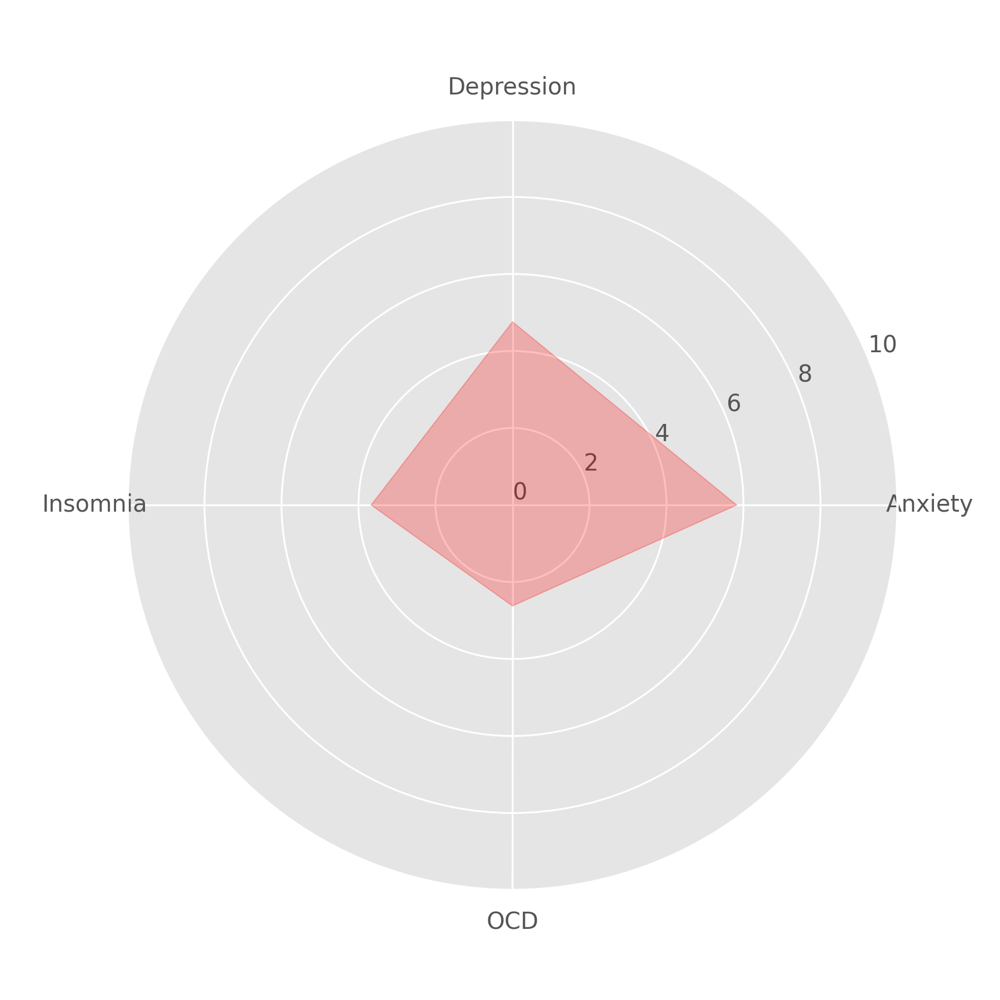

    
<b>
- Anxiety (Lo Âu): Điểm trung bình là 5.8, đây là điểm số cao nhất trong bốn loại bệnh. Điều này cho thấy tình trạng lo âu xuất hiện nhiều nhất hoặc nghiêm trọng nhất trong số các tình trạng được khảo sát. Người tham gia có xu hướng trải qua các triệu chứng lo âu ở mức độ trung bình đến khá cao.

- Depression (Trầm Cảm): Điểm trung bình là 4.75, nằm ở mức độ trung bình. Điều này chỉ ra rằng tình trạng trầm cảm cũng khá phổ biến trong nhóm người được khảo sát, nhưng không phổ biến hoặc nghiêm trọng bằng lo âu.

- Insomnia (Mất Ngủ): Điểm trung bình là 3.67, thấp hơn so với lo âu và trầm cảm. Điều này có thể cho thấy mức độ mất ngủ không quá nghiêm trọng hoặc không quá phổ biến so với hai tình trạng kia trong nhóm này.

- OCD (Rối Loạn Ám Ảnh Cưỡng Chế): Điểm trung bình thấp nhất là 2.62, cho thấy rằng trong số các tình trạng được khảo sát, OCD có vẻ ít phổ biến hoặc ít nghiêm trọng nhất.
  </b>

<b>
=> Nhìn chung, dựa trên điểm trung bình, có thể thấy rằng lo âu và trầm cảm là hai vấn đề tâm lý chính mà nhóm người tham gia khảo sát gặp phải. Điều này có thể phản ánh nhu cầu chú trọng hơn vào việc điều trị và hỗ trợ cho những người đang chịu đựng lo âu và trầm cảm.
</b>

<b>Bước 2: Đánh giá các triệu chứng này.
</b>

<b>Bước 3: Vẽ biểu đồ venn thể hiện sự giao nhau của các triệu chứng.
</b>

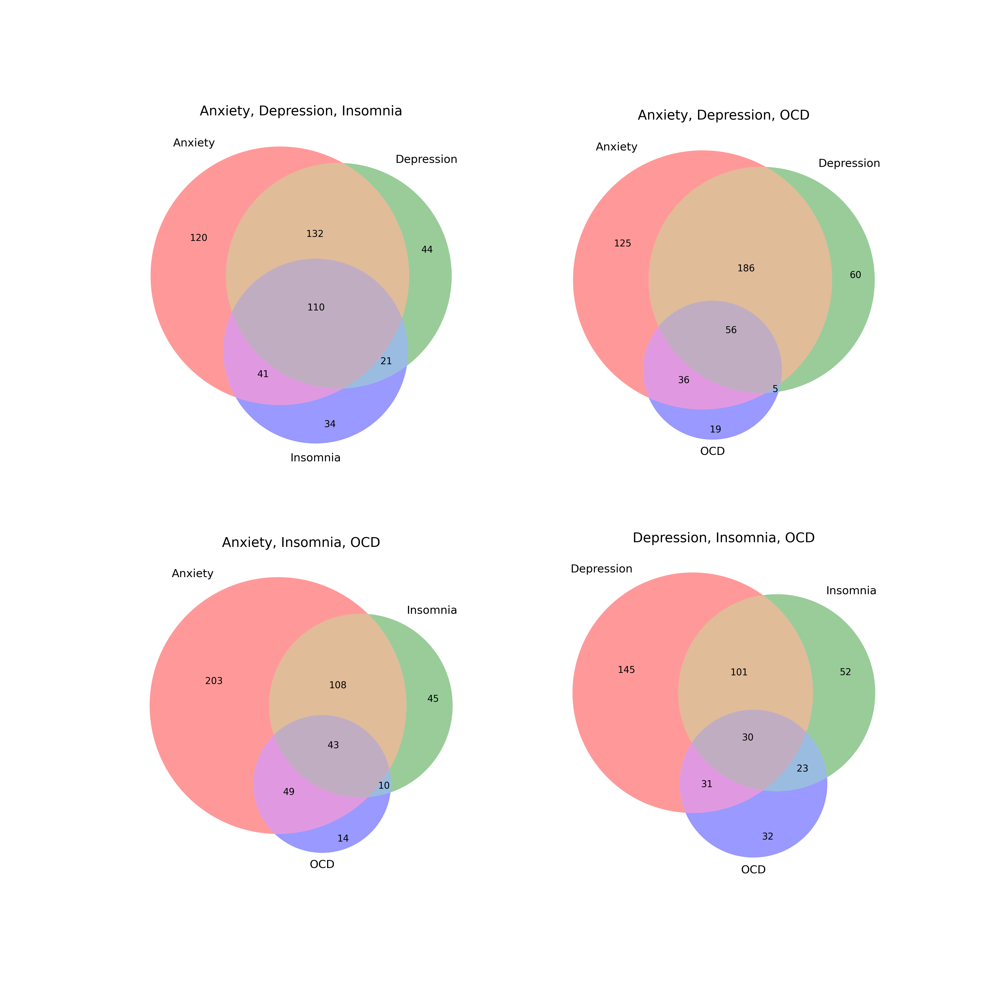

    
<b>
- Từ các set ta có thể xác định được số người mắc phải triệu chứng tâm lý: khoảng 400 người mắc phải lo âu, 300 người mắc phải trầm cảm, 200 người mắc phải mất ngủ và hơn 100 người mắc phải rối loạn ám ảnh cưỡng chế.
- Sau đó là biểu đổ Venn để thể hiện mỗi liên hệ giữa các triệu chứng tâm lý. Nổi bật nhất là biểu đồ số 1 với Anxiety, Depression, Insomnia (Lo âu, Trầm cảm, Mất ngủ): Phần giao nhau lớn nhất là giữa Anxiety và Depression với 132 người, cho thấy có một số lượng lớn người tham gia mắc cả hai tình trạng này. 101 người mắc cả ba tình trạng, cũng là một con số đáng kể, chỉ ra rằng có một mối liên hệ mạnh mẽ giữa ba tình trạng này.
- Tương tự những biểu đồ còn cũng thể hiện mối liên hệ giữa các tình trạng tâm lý khác nhau. Nhưng tình trang tâm lý Anxiety và Depression nổi bật nhất, sau đó đến Insomnia và OCD chỉ có một số ít người tham gia mắc phải.
</b>

<b>
=> Tóm lại, các biểu đồ Venn này hữu ích trong việc trực quan hóa mức độ chồng chéo giữa các tình trạng tâm lý khác nhau trong một nhóm người. Chúng cho thấy rằng Anxiety và Depression có vẻ như là hai tình trạng phổ biến nhất và thường xuyên xuất hiện cùng nhau.
</b>

<b>Bước 4: Đánh giá khả năng một người có thể mắc nhiều triệu chứng cùng lúc.
</b>

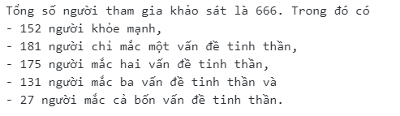

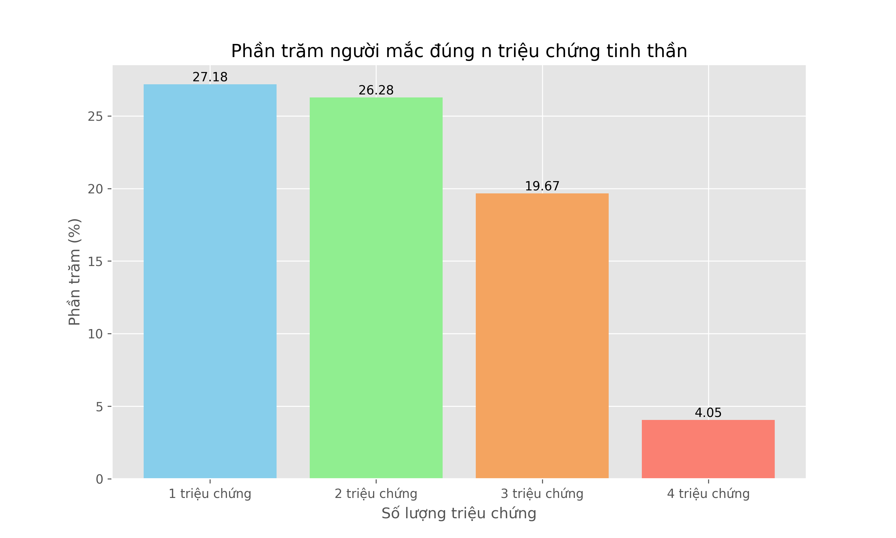

    
<b>Tổng kết  </b>

<b>Sự Phổ Biến của Các Triệu Chứng:</b>

Có một tỷ lệ đáng kể người tham gia khảo sát trải qua ít nhất một vấn đề về sức khỏe tinh thần, với một số lượng lớn người chỉ mắc một triệu chứng.
Tuy nhiên, có một số lượng không nhỏ người mắc hai triệu chứng, chỉ ra rằng sức khỏe tinh thần là một vấn đề đa diện và có thể ảnh hưởng đến người tham gia theo nhiều cách khác nhau. Có đến hơn 75% số người tham gia mắc ít nhất một triệu chứng về tình thần. Điều này phản ánh đây là vấn đề quan tâm của sức khỏe tinh thần.

<b>Mức Độ Nghiêm Trọng:</b>

Dựa vào điểm trung bình của từng loại bệnh, Anxiety (Lo âu) và Depression (Trầm cảm) có điểm số cao hơn so với Insomnia (Mất ngủ) và OCD (Rối loạn ám ảnh cưỡng chế), cho thấy rằng lo âu và trầm cảm có thể là những vấn đề sức khỏe tinh thần phổ biến và nghiêm trọng hơn trong nhóm này.

<b>Sự Chồng Chéo Của Các triệu chứng tinh thần:</b>

Biểu đồ Venn cho thấy có sự chồng chéo đáng kể giữa các tình trạng tâm lý. Điều này phản ánh thực tế phức tạp của sức khỏe tinh thần, nơi một người có thể trải qua nhiều vấn đề cùng một lúc, và những vấn đề này thường có mối liên quan chặt chẽ với nhau.

  

    
<b>Câu hỏi 2: Phân tích những lựa chọn, sở thích nghe nhạc của những người tham gia khảo sát khi các triệu chứng tinh thần diễn ra thường xuyên hơn (> 5 ở thang 10) có gì thay đổi hay không?
</b>

<b>Câu hỏi có lợi ích gì: </b> Việc phân tích những yếu tố tác động đến sức khỏe tinh thân giúp chúng ta có cái nhìn chi tiết hơn về vấn để tinh thần của mọi người. Nhìn nhận việc nghe nhạc tác động đến sức khỏe ở nhiều góc cạnh khác nhau, tìm ra những khác biệt của những người các triệu chứng về sức khỏe tinh thần, để kip thời phát hiện và chữa trị sớm nhất

<b>Cách trả lời câu hỏi: </b>

- Có 4 bước:

  - _Bước 1_: Đánh giá số giờ nghe nhạc của những người có mức độ của các triệu chứng cao so với những người còn lại.

  - _Bước 2_: Đánh giá tần suất nghe nhạc của những người có mức độ của các triệu chứng cao so với những người còn lại.

  - _Bước 3_: Đánh giá về sở thích âm nhạc của nhóm người này.

  - _Bước 4_: Đánh giá mức độ ảnh hưởng của âm nhạc lên sức khỏe tinh thần của họ.

    

<b>Bước 1: Đánh giá số giờ nghe nhạc của những người có mức độ của các triệu chứng cao so với những người còn lại.
</b>

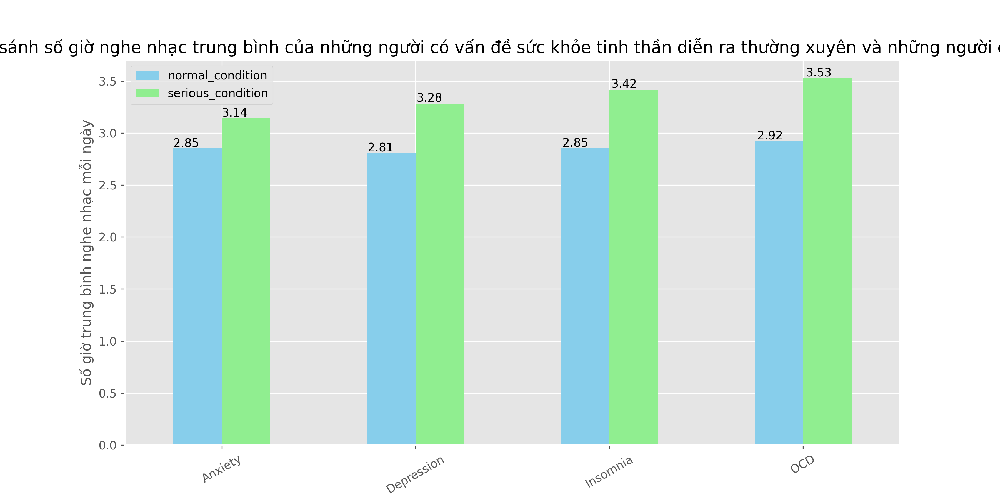

 <b>

- Có thể thấy trung bình số giờ nghe nhạc trong ngày của các nhóm người này cao hơn so với trung bình của tất cả mọi người nhưng không đáng kể
- Tiếp theo chúng ta tìm hiểu tần suất nghe nhạc của những người này ở từng thể loại nhạc
  </b>
  

<b>Bước 2: Đánh giá tần suất nghe nhạc của những người có mức độ của các triệu chứng cao so với những người còn lại.
</b>

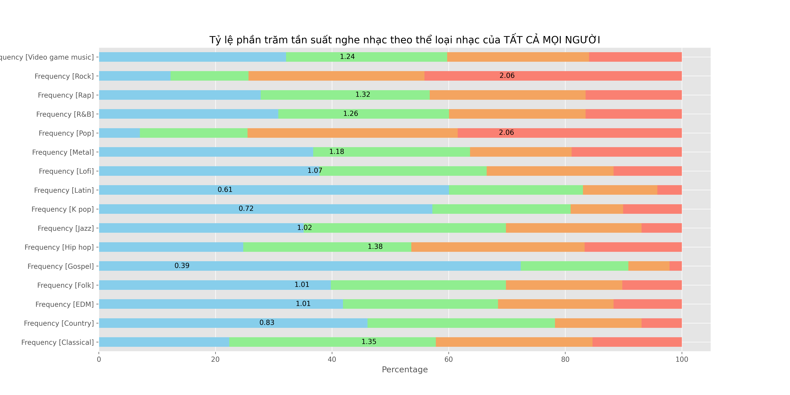
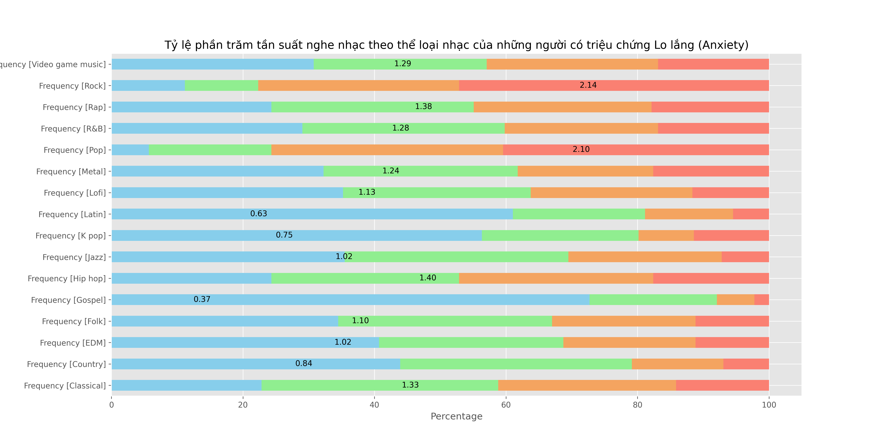
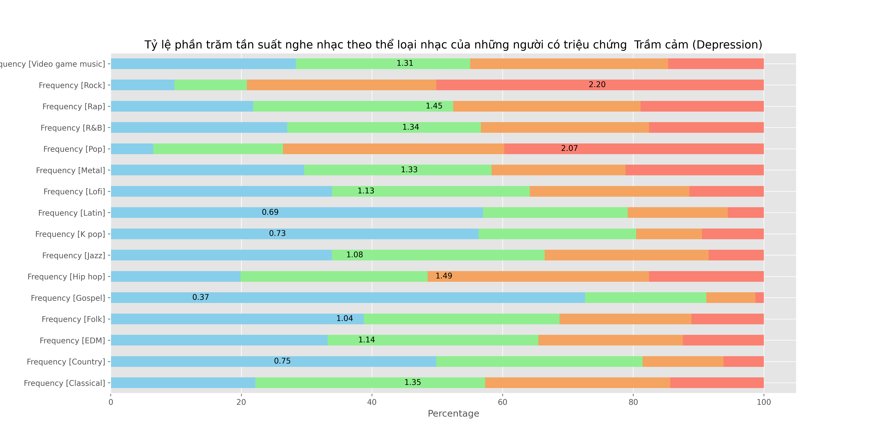
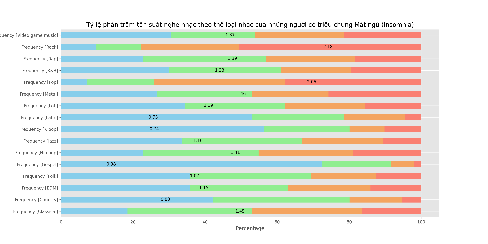
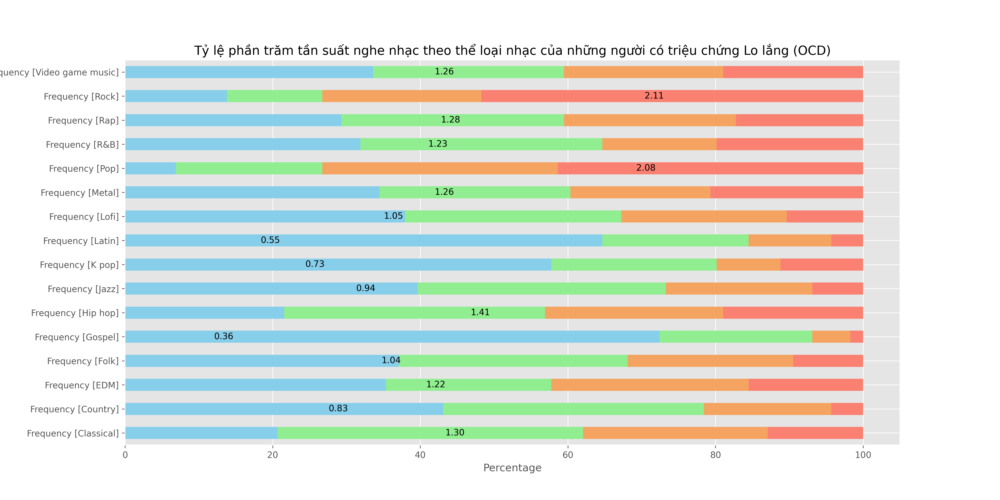

    
<b>
- Tần suất trung bình  tất cả mọi người so với Người Có Lo Âu: Trong biểu đồ dành cho những người có triệu chứng lo âu, có thể thấy rõ ràng tần suất nghe hầu hết các thể loại nhạc đều tăng lên, đặc biệt là Rock và Pop, cho thấy những người lo âu có thể sử dụng việc nghe nhạc như một phương pháp tự giúp bản thân nhiều hơn người bình thường.

- Tần suất trung bình tất cả mọi người so với Người Có Trầm Cảm: Những người có trầm cảm cho thấy tần suất nghe nhạc Metal và Rock cao đáng kể. Điều này có thể ám chỉ một sở thích đối với các thể loại có thể phản ánh hoặc ảnh hưởng đến tình trạng cảm xúc của họ.

- Tần suất trung bình tất cả mọi người với Người Có Mất Ngủ: Những người mất ngủ nghe nhạc video game và Metal với tần suất cao hơn. Điều này có thể chỉ ra rằng họ sử dụng nhạc như một phương tiện để gây ngủ hoặc quản lý căng thẳng liên quan đến tình trạng mất ngủ.

- Tần suất trung bình tất cả mọi người so với Người Có OCD (Rối Loạn Ám Ảnh Cưỡng Chế) dường như không khác nhau. Do đó khó có thể nhận biết được người bị OCD so với người bình thường.

- Xuyên suốt tất cả các biểu đồ, nhạc Gospel thường có tần suất nghe thấp hơn ở những người có các điều kiện này so với dân số tổng thể, có thể cho thấy rằng thể loại này ít được sử dụng hoặc ít hiệu quả như một chiến lược đối phó cho những nhóm cụ thể này.
  </b>

<b>
=> Các biểu đồ cho thấy những người có vấn đề sức khỏe tâm thần có thể có thói quen nghe nhạc khác biệt so với dân số chung, có khả năng sử dụng nhạc nhiều hơn như một công cụ trị liệu hoặc như một phản ánh của tình trạng cảm xúc của họ
</b>

<b>Bước 3: Đánh giá về sở thích âm nhạc của nhóm người này.
</b>

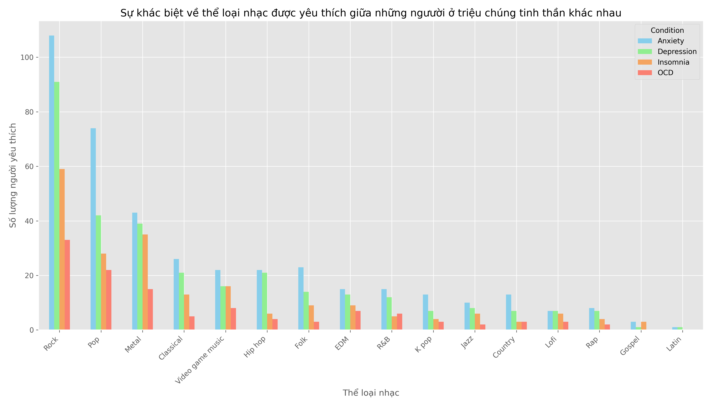

    
<b>
- Thể loại Rock dường như là thể loại được yêu thích nhất trong số các nhóm có các triệu chứng tâm thần, với số lượng người yêu thích đáng kể trong mỗi nhóm.
- Pop và Metal cũng là những thể loại được nhiều người yêu thích, đặc biệt là trong nhóm người có triệu chứng lo âu và trầm cảm.
- Nhạc cổ điển và nhạc video game có số lượng người yêu thích tương đối ổn định giữa các nhóm, nhưng không phải là thể loại được yêu thích nhất.
- Những thể loại như Hip hop, Folk, EDM, R&B, K-pop, và Jazz có số lượng người yêu thích ít hơn so với Rock, Pop, và Metal.
- Thể loại Country, Lofi, Rap, Gospel, và Latin có số lượng người yêu thích ít nhất trong các nhóm này.
</b>

<b>Bước 4: Đánh giá mức độ ảnh hưởng của âm nhạc lên sức khỏe tinh thần của họ.
</b>

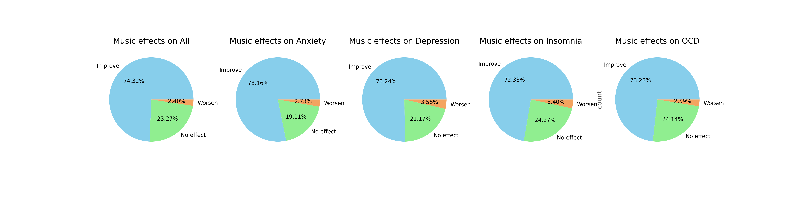

<b>
Nhìn chung, những biểu đồ này cho thấy rằng đa số mọi người, bao gồm cả những người có triệu chứng bệnh cụ thể, đều cảm thấy có lợi khi nghe nhạc. Tuy nhiên, tỷ lệ những người cảm thấy xấu đi khi nghe nhạc tăng lên đôi chút trong các nhóm có các triệu chứng bệnh, điều này có thể phản ánh sự cần thiết của việc lựa chọn đúng loại nhạc cho từng cá nhân và tình trạng sức khỏe tâm thần cụ thể của họ.
</b>

    
<b>Tổng kết nghiên cứu  </b>

<b>Câu hỏi: </b>
Phân tích so sánh sự ảnh hưởng của âm nhạc đối với cảm xúc và tình trạng tâm thần của mọi người, cũng như những người đang trải qua các triệu chứng tâm thần như lo âu, trầm cảm, mất ngủ và OCD.

<b>Trả lời :</b>

Từ biểu đồ tần suất nghe nhạc, chúng đã phát hiện ra rằng:

- Người có triệu chứng lo âu và trầm cảm có xu hướng nghe nhạc Rock và Pop nhiều hơn.
- Người mất ngủ có xu hướng nghe nhạc video game và Metal nhiều hơn.
- Người có OCD tần xuất nghe không khác gì so với người bình thường

- Từ biểu đồ sở thich âm nhạc của những người có triệu chứng bệnh ta thấy: ở thích âm nhạc cá nhân có liên quan đến triệu chứng tâm thần và có thể phản ánh cách thức mà mỗi người đối phó với tình trạng sức khỏe tâm thần của họ. Thể loại Rock và Pop được yêu thích rộng rãi trong tất cả các nhóm, trong khi các thể loại khác như Metal có thể được ưa chuộng bởi những người trải qua trạng thái cảm xúc sâu sắc hơn. Sự đa dạng trong sở thích âm nhạc cho thấy việc lựa chọn âm nhạc để hỗ trợ sức khỏe tâm thần là một trải nghiệm rất cá nhân và cần phải được cá nhân hóa.

Biểu đồ về ảnh hưởng của âm nhạc cho thấy:

- Đa số mọi người trong các nhóm triệu chứng khác nhau đều cảm thấy cải thiện khi nghe nhạc, với tỷ lệ cao nhất là ở những người có lo âu.
- Có một tỷ lệ nhỏ người cảm thấy tình trạng của họ xấu đi khi nghe nhạc, đặc biệt là ở nhóm người mất ngủ.
- Số lượng người không cảm thấy có tác động gì từ âm nhạc cũng khá đáng kể.

=> Những phát hiện này cho thấy âm nhạc có thể đóng vai trò là một công cụ hữu ích trong việc cải thiện tình trạng tâm thần hoặc ít nhất là cung cấp một phương tiện thoải mái và giải trí cho người nghe. Tuy nhiên, cũng có một tỷ lệ nhất định mà âm nhạc không mang lại hiệu quả tích cực hoặc thậm chí có thể làm tình hình tồi tệ hơn, điều này nhấn mạnh tầm quan trọng của việc lựa chọn đúng loại nhạc cho từng cá nhân.

Qua đó, nghiên cứu của bạn đã cung cấp cái nhìn sâu sắc về mối liên hệ giữa âm nhạc và sức khỏe tâm thần, đồng thời cũng phản ánh sự khác biệt về sở thích âm nhạc giữa những người có triệu chứng tâm thần so với dân số chung. Những thông tin này có thể hữu ích cho việc phát triển các chương trình can thiệp sức khỏe tâm thần thông qua âm nhạc hoặc chỉ đơn giản là cung cấp kiến thức cho những người đang tìm cách sử dụng âm nhạc để cải thiện tâm trạng của mình.

  

    
<b>Câu 3: Những người ở độ tuổi khác nhau có sở thích về âm nhạc khác nhau như thế nào? Xu hướng thưởng thức âm nhạc của họ ảnh hưởng như thế nào?
</b>

<b>Câu hỏi có lợi ích gì: </b> Việc phân tích những yếu tố tác động đến sức khỏe tinh thân giúp chúng ta có cái nhìn chi tiết hơn về vấn để tinh thần của mọi người. Nhìn nhận việc nghe nhạc tác động đến sức khỏe ở nhiều góc cạnh khác nhau, tìm ra những khác biệt của những người các triệu chứng về sức khỏe tinh thần, để kip thời phát hiện và chữa trị sớm nhất

<b>Cách trả lời câu hỏi: </b>

- Có 3 bước:

  - _Bước 1_: Thống kê độ tuổi của mọi người theo thể loại nhạc yêu thích

  - _Bước 2_: Chia các nhóm tuổi và tiến hành đánh giá lại

  - _Bước 3_: Đánh giá mức độ nghiêm trọng của các triệu chứng tâm lý theo nhóm tuổi

<b>Bước 1: Thống kê độ tuổi của mọi người theo thể loại nhạc yêu thích
</b>

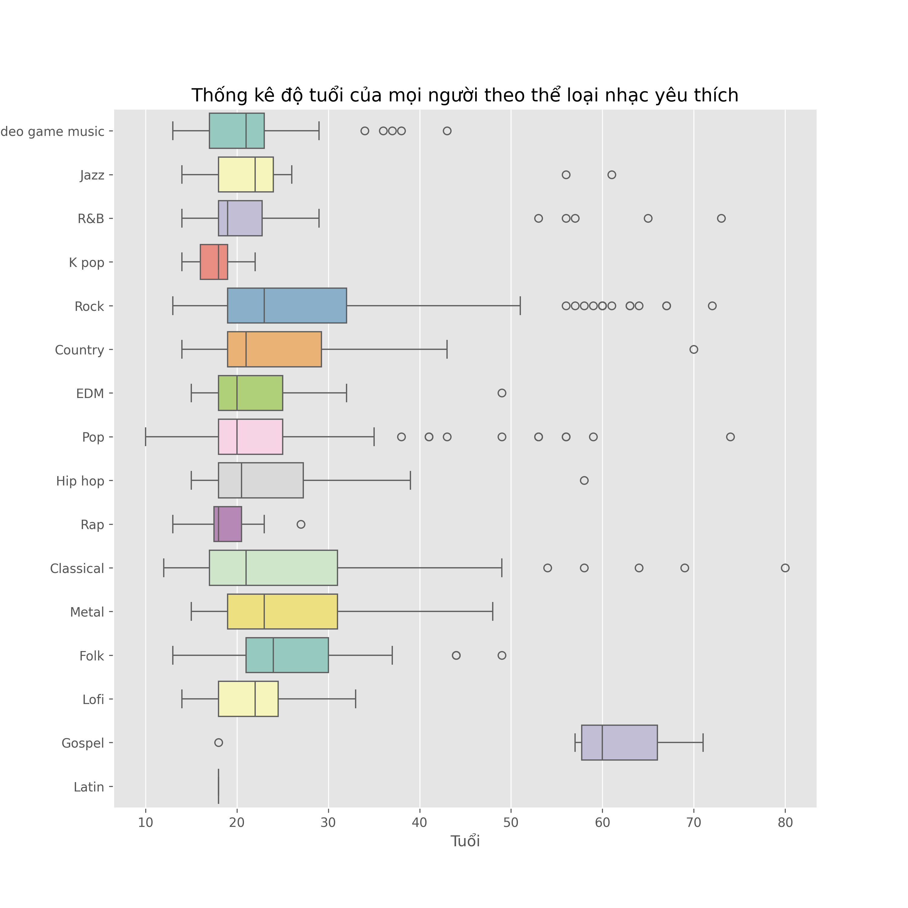

    
<b>
- Các thể loại như Rock, Classical, Metal có sự phân bố độ tuổi rộng, chỉ ra rằng chúng được nghe bởi một lượng người nghe đa dạng về tuổi tác.
- Thể loại như Rap và Kpop có sự phân bố tuổi tương đối hẹp, chỉ ra rằng đối tượng nghe nhạc có xu hướng tập trung vào một nhóm tuổi nhất định.
- Gospel hầu như được nghe mới những những người có độ tuổi tên 55 tuổi
- Latin music dường như có số lượng người nghe ít nhất và có phân bố tuổi hạn chế so với các thể loại khác bởirong khảo sát chỉ ghi nhận được 1 trường hợp thích nghe thể loại nhạc này
</b>

- Có vẻ như số lượng người tham gia không khảo sát được toàn bộ các độ tuổi. Khó có thể đánh giá theo từng độ tuổi được. Để tiếp tục đánh giá được, chúng ta sẽ chia ra thành các nhóm tuổi
- Vì độ tuổi phân bố khác nhau trong bộ dữ liệu. Nên chúng em quyết định chia độ tổi thành các khoảng dựa theo quantitle của dữ liệu. Chúng em lựa chọn bins là 10 để đánh giá.

<b>Bước 2: Chia các nhóm tuổi và tiến hành đánh giá lại
</b>

- Sau khi chia nhóm tuổi ta có tỉ lệ các nhóm như sau:
  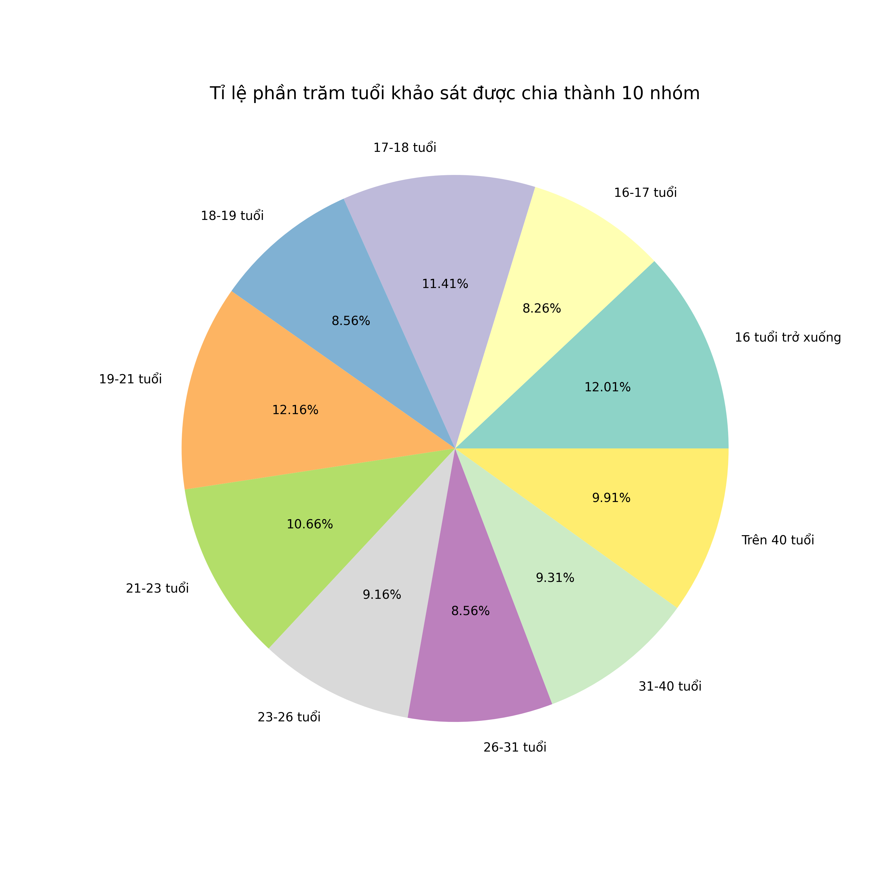

- Tiến hành đánh giá lại sở thích âm nhạc theo từng nhóm tuổi

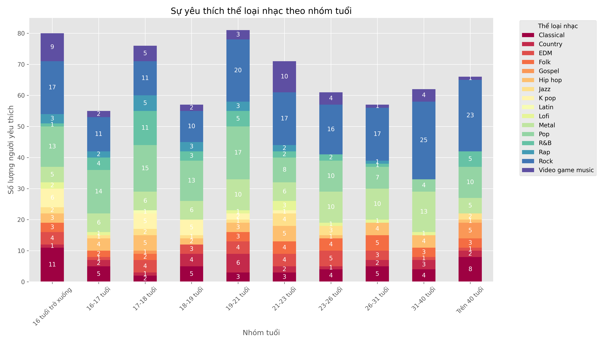

    
<b>
- Phân bố độ tuổi: Có vẻ như mỗi nhóm tuổi có sự yêu thích khác nhau đối với các thể loại nhạc. Thể loại nhạc "Rock" và "Pop" dường như phổ biến trong hầu hết các nhóm tuổi, với số lượng người yêu thích đáng kể. Nhưng thể loại "Rock" thì những người trên 30 tuổi có vẻ như nghe nhiều hơn.

- Thể loại nhạc phổ biến: Thể loại "Video game music" nổi bật trong nhóm tuổi trẻ, trong khi "Classical" được yêu thích bởi nhóm tuổi "Trên 40 tuổi" và nhóm tuổi "Dưới 16"

- Sự đa dạng trong sở thích: Mỗi nhóm tuổi có sự đa dạng trong sở thích âm nhạc của họ, không có thể loại nhạc nào chiếm ưu thế tuyệt đối trong bất kỳ nhóm tuổi nào.

- Ngoại lệ và biến động: Có một số ngoại lệ trong từng nhóm tuổi, như thể hiện qua số lượng người yêu thích nhất định trong các thể loại nhạc khác nhau. Điều này cho thấy sự đa dạng trong sở thích cá nhân không hoàn toàn bị hạn chế bởi độ tuổi.
  </b>

<b>
=> Tóm lại, biểu đồ cung cấp cái nhìn tổng quan về sự phân bố sở thích âm nhạc qua các nhóm tuổi và cho thấy âm nhạc là một phần của văn hóa đa dạng, với mỗi nhóm tuổi đều có những sở thích riêng biệt và độc đáo của họ.
</b>

Vậy xu hướng thưởng thức âm nhạc của mỗi người có sự khác biệt dựa trên tuổi tác của họ không?

- Chúng ta hãy xem mọi người có nghe nhạc lúc làm việc, chơi nhạc cụ để thưởng thức âm nhạc hay có thói quen sáng tác nhạc như một cách hưởng thụ âm nhạc hay không, và cuối cùng có thích thể loại nước ngoài hay không?
- Ở phần chỉ có 2 xu hướng là có hoặc không nên chúng ta sẽ xem xét sự phân bố của những người tham gia theo độ tuổi.

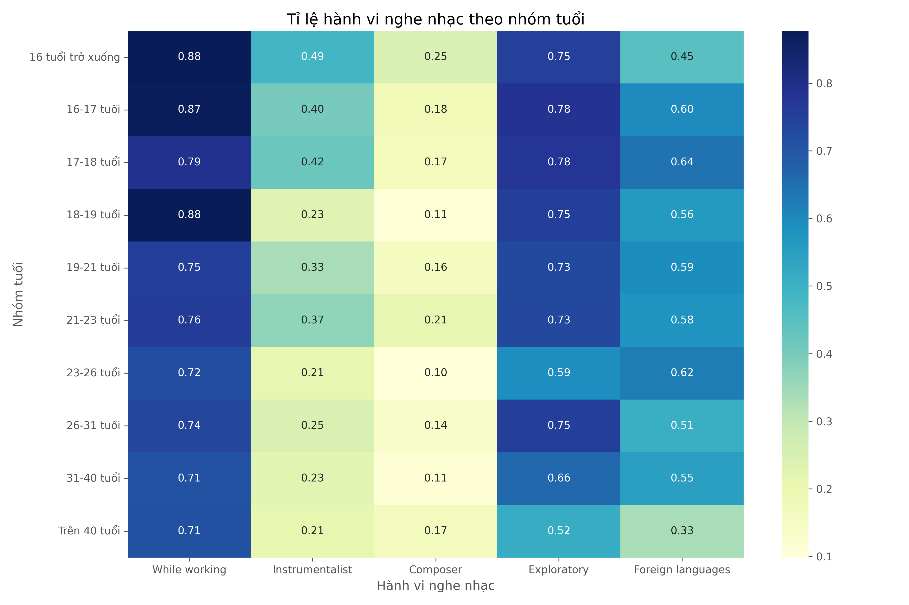

    
<b>
- Tỉ lệ những người đang làm việc ("While working") khá cao qua tất cả các nhóm tuổi, đặc biệt là nhóm "16 tuổi trở xuống" và "18-19 tuổi" với tỉ lệ cao nhất.
- Nhóm "16-17 tuổi" và "17-18 tuổi" có tỉ lệ cao những người chơi nhạc cụ ("Instrumentalist") và sáng tác nhạc ("Composer"), nhưng tỉ lệ này giảm dần ở các nhóm tuổi lớn hơn.
- Hoạt động khám phá các nghệ sĩ thể loại nhạc  ("Exploratory") sau khi nghe có tỉ lệ thấp nhất ở nhóm "Trên 40 tuổi", cho thấy sự giảm nhu cầu hoặc sự quan tâm đến hoạt động khám phá ở nhóm tuổi này.
- nghe nhạc nước ngoài ("Foreign languages") được quan tâm nhiều ở nhóm tuổi trẻ, đặc biệt là nhóm "16-17 tuổi" với tỉ lệ cao nhất, và tỉ lệ này giảm dần khi tuổi tác tăng lên.
</b>

<b>Bước 3: Đánh giá mức độ nghiêm trọng của các triệu chứng tâm lý theo nhóm tuổi
</b>

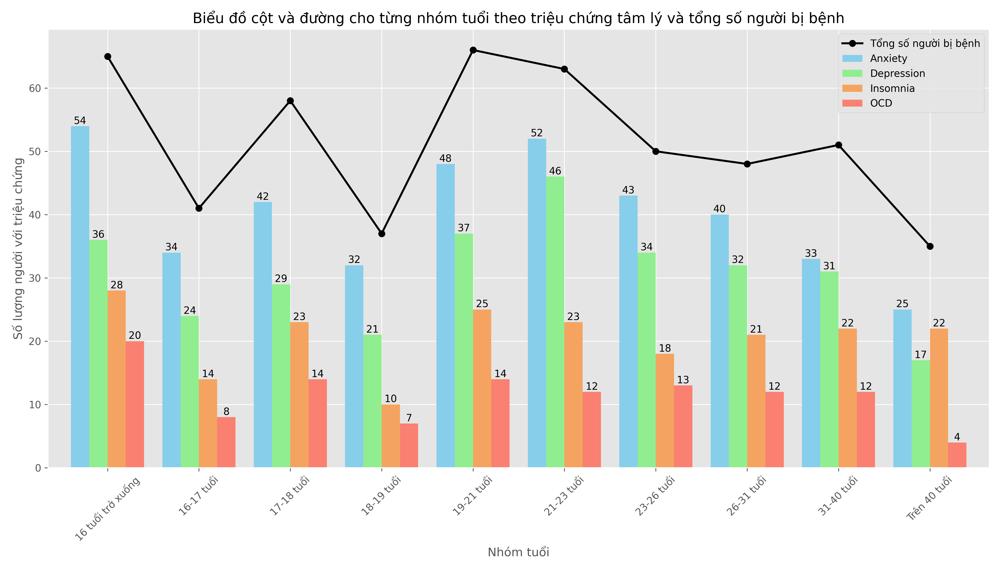

    
<b>
- Nhìn vào biểu đồ cho thấy rằng tổng số lượng triệu chứng tâm lý theo từng nhóm tuổi cùng với đó là số lượng từng loại bệnh. 
- Biểu đồ nhìn chung, giai đoạn tuổi từ 16 đến 21 tuổi, khi tâm lý chưa vững vàng, con người có thể xuất hiện nhiều triệu chứng tâm lý nhất và biến động không thể kiểm soát đươc. 
- Số lượng người bị các vấn đề về Lo lắng, Mất ngủ và OCD lại xuất hiện nhiều nhất ở những bạn dưới 16 tuổi (điều này có vẻ không hợp lý) 
- ở độ tuổi từ 19-23 tuổi, dường như các vấn đề xuất hiện nhiều nhất là Trầm cảm và Lo lắng. Đây là điều dễ hiểu vì đây là giai đoạn mà con người bắt đầu có những áp lực lớn về học tập, công việc, tương lai, tình cảm,..
- Dần về sau thì những người bị các triệu chứng thì ít hơn theo độ tuổi. Điều này có thể hiểu là khi con người trưởng thành, có thể tự kiểm soát được tâm lý của mình hơn.

</b>

<b>
=> tổng số lượng người có vấn để tâm lý cũng xuất hiện nhiều nhất ở những người 16 tuổi trở xuống, sau đó là độ tuổi từ 19-23. Điều này cho thấy rằng các bệnh đang dần trẻ hóa đi, và đặt ra mối quan tâm đến tâm lý ở những bạn trẻ nhiều hơn.
Nếu không điều trị sớm có thể dẫn đến những hậu quả khó lường
</b>

  

    
<b>Câu hỏi 4. Số nhịp điệu của dòng dòng nhạc yêu thích có ảnh hưởng tới sức khỏe tinh thần của họ hay không?
</b>

<b>Câu hỏi có lợi ích gì: </b> Mỗi dòng nhạc có một nhịp điệu riêng, một đặc trưng riêng của loại nhạc đó. Do đó chúng ta phải cần tìm hiểu xem những nhịp điệu của mỗi dòng nhạc có tác động kích thích não, hoặc gây ra tác động tinh thần nào không đối với con người.

<b>Cách trả lời câu hỏi: </b>

- Có 3 bước:

  - _Bước 1_: Vẽ histogram các mức BPM, thống kê BPM trung bình của các dòng nhạc

  - _Bước 2_: Phân các dòng nhạc thành các nhóm theo mức BPM

  - _Bước 3_: Đánh giá mức độ ảnh hưởng của BPM đến các triệu chứng tâm lý

<b>Bước 1: Vẽ histogram các mức BPM, thống kê BPM trung bình của các dòng nhạc
</b>

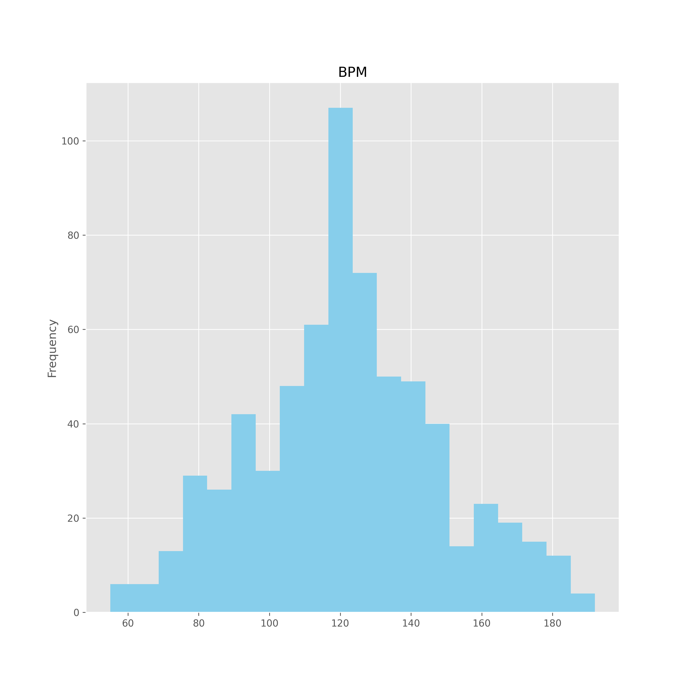

- Thống kê mức BPM trung bình cho các dòng nhạc

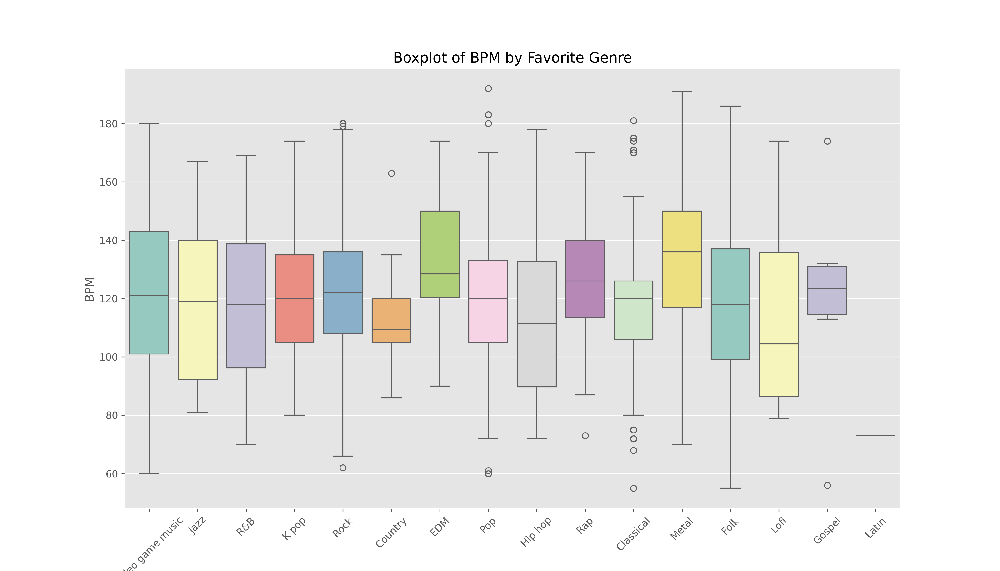

<b>Bước 2: Phân các dòng nhạc thành các nhóm theo mức BPM
</b>

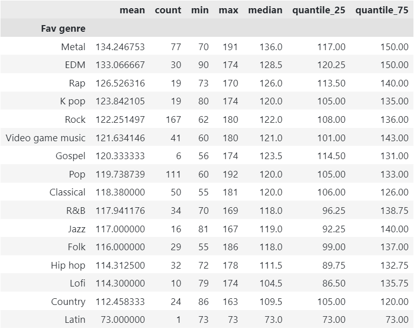

    
<b>

Dựa vào biểu đồ và những dữ liệu chi tiết có thể thấy rõ sự phân chia nhịp độ trung bình (BPM) giữa các thể loại nhạc:

- Nhóm Nhịp Độ Cao: Metal và EDM đứng đầu danh sách với BPM trung bình cao nhất, cho thấy đây là các thể loại nhạc có năng lượng và độ sôi động rất cao.

- Nhóm Nhịp Độ Trung Bình đến Cao: Rap, K pop, Rock, và Video game music có BPM trung bình từ khoảng 120 đến 126, cho thấy những thể loại này thường có nhịp điệu nhanh và phù hợp với nhu cầu giải trí đa dạng.

- Nhóm Nhịp Độ Trung Bình đến Thấp: Gospel, Pop, Classical, R&B, Jazz, Folk và Hip hop có BPM trung bình nằm trong khoảng từ khoảng 115 đến 120. Các thể loại này có thể bao gồm cả bản nhạc nhanh và chậm, phản ánh sự đa dạng trong cách biểu đạt và cảm xúc trong âm nhạc.

- Nhóm Nhịp Độ Thấp:Lofi và Country có BPM trung bình dưới 115 BPM, thấp hơn các thể loại kể trên, điều này phản ánh tính chất nhẹ nhàng và tình cảm của thể loại nhạc này.

- Đáng chú ý: Latin chỉ có một bài hát được đưa vào dữ liệu với BPM là 73, có thể không đại diện cho toàn bộ thể loại nhạc Latin.
  </b>

<b>
=> Nói chung, BPM trung bình phản ánh không chỉ phong cách và đặc trưng của các thể loại nhạc mà còn cho thấy sở thích và xu hướng của người nghe nhạc. Thể loại nhạc có BPM cao thường liên quan đến năng lượng và sự hứng khởi, trong khi thể loại nhạc có BPM thấp hơn mang lại không gian tĩnh lặng và sâu lắng hơn.
</b>

<b>Bước 3: Đánh giá mức độ ảnh hưởng của BPM đến các triệu chứng tâm lý
</b>

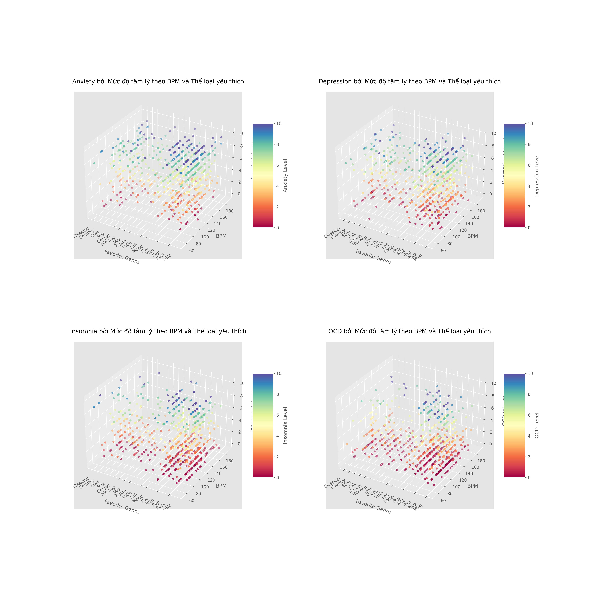

    
<b>
- Ở các người tham gia có xu hướng Lo lắng và Trầm Cảm cao dể dàng nhận thấy rằng họ thường nghe những loại nhạc Rock, Rap, Metal,Pop,  R&B. Ở mức BPm trên 120 thì họ sẽ có nhiều triệu chứng hơn. Nhưng trái ngược lại họ ít có cảm giác đốt với các triệu chứng Mất ngủ hay OCD.

- Riêng thể loại nhạc EDM tuy có xung nhịp cao nhưng rất ít người yêu thích thể loại nhạc đó cảm thấy có vấn đề đối với trạng thái tinh thần của mình so với những thể loại nhạc có cùng xung nhịp khác.
  </b>

<b>
=> Thể loại nhạc và xung nhịp của loại nhạc đó cũng có một tác động lớn đến các vấn đề tâm lý. Nhìn vào biểu đồ có thể thấy những loại nhạc có mức độ xung nhịp trên 120 có thể ảnh hưởng đến tinh thần của mọi người, khiên cho mọi người cảm thấy bất an, lo âu và có xu hướng xuất hiện cái triệu chứng tinh thần thường xuyên hơn.
</b>

    
<b>Câu hỏi 5. Mức độ ảnh hưởng của các thuộc tính dữ liệu đến với các vấn đề tâm lý ở mức độ như thế nào?
</b>

<b>Câu hỏi có lợi ích gì: </b> Qua các câu hỏi trên, phần nào đã định hình được mức độ ảnh hưởng của âm nhạc lên sức khỏe tinh thần của chúng ta. Nhưng để hiểu chính xác mức độ ảnh hưởng lớn như thế nào ta cần phải minh họa trực quan bằng những con số, cái mà những mô hình dựa vào đó để dự đoán cột mục tiêu

<b>Cách trả lời câu hỏi: </b>

- Có 3 bước:

  - _Bước 1_: Xử lí dữ liệu đầu vào

  - _Bước 2_: Trích xuất các cột số và cột phân loại để đánh giá

  - _Bước 3_: Tiến hành đánh giá

<b>

Bước 1: Xử lí dữ liệu đầu vào
</b>

- Tiến hành đưa các cột dữ liệu đánh giá mức độ các triệu chứng về kiểu int, cột nhóm tuổi về kiểu object.

- Loại bỏ các cột không cần thiết: `'Age', 'Fav gerne encoded'`

- Chuẩn hóa lại tên các cột.

<b>Bước 2: Trích xuất các cột số và cột phân loại để đánh giá
</b>

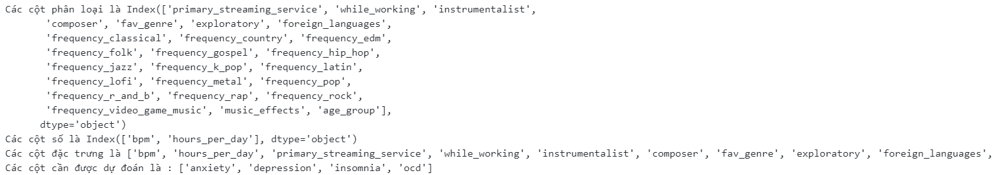

<b>Bước 3: Tiến hành đánh giá
</b>

- Sau khi đánh giá bằng cách phương pháp Anova, Pearson lần lượt cho các cột phân loại và cột số, nhóm thu được kết quả như sau:

  - Anova

  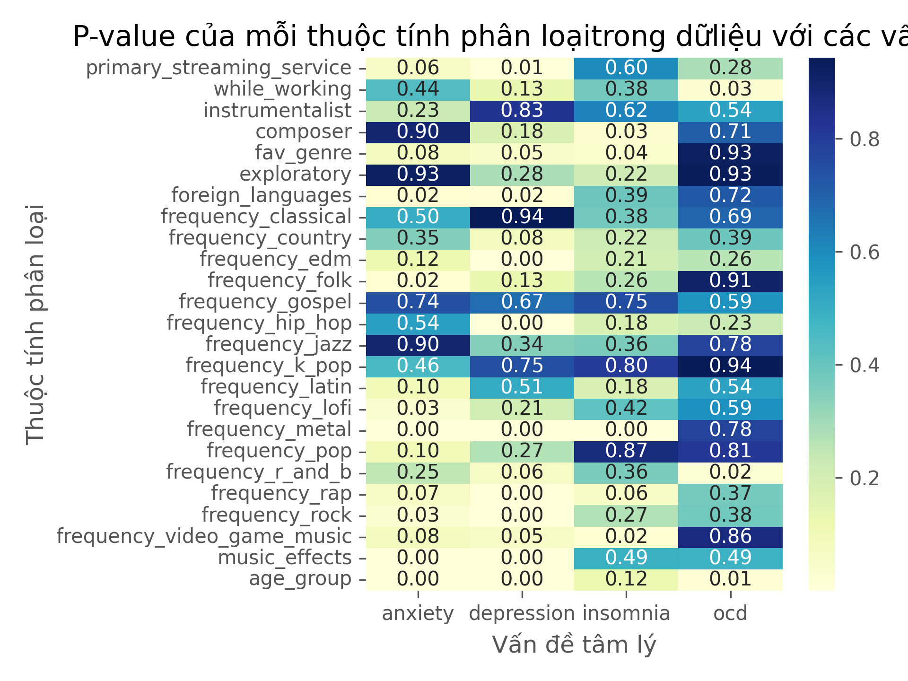

<b>

- Có một sự ảnh hưởng khác biệt lớn giữa các thuộc tính đối với cột mục tiêu, nơi mà cột này ảnh hưởng đánh kể đến vấn đề tâm lý này nhưng không ảnh hưởng đến các triệu chứng tâm lý khác. Dễ thấy ở Nhóm tuổi, Nhóm tuổi có ảnh hưởng lớn đến các vấn đề tâm thần, trong khi đó côt 'While working' dường như không có mức ảnh lớn.
- Các cột frequency ít nhiều cũng ảnh hưởng đến các cột mực tiêu nhưng không đều và nhiều chô bất hơn lý đối với các triệu chứng "Mất ngủ" hay "OCD".
- Fav gen cũng cho thấy mức không ảnh hưởng gì đến OCD.
  </b>

<b>
=> Dựa vào các p-value để xem xét mức ảnh hưởng của các cột đến với cột mục tiêu. Nếu các cột riêng lẻ, ta chưa thấy rõ ràng lắm các sự ảnh hưởng mạnh mẽ của các cột đến với cột mục tiêu. Một câu hỏi đặt ra là nếu kết hợp các cột này lại thì mô hình có cho hiệu suất cao hay không. Cần lựa chọn các cột mục tiêu rõ ràng đối với từng loại vấn đề tâm lý. Khi có sự khác biệt lớn như các cột so với "Lo lắng", "Trầm cảm" và các cột mục tiêu "Mất ngủ", "OCD"
</b>

- Pearson

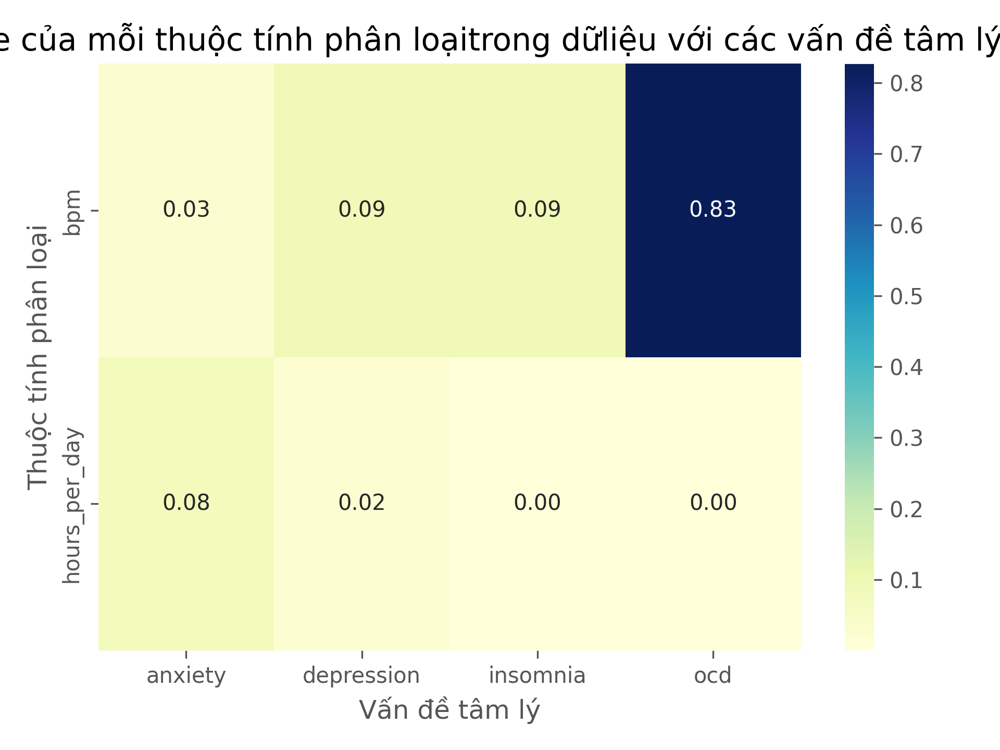

    
<b>
Đối với BPM: 
- Anxiety: Có p-value là 0.02596, nghĩa là có một mức độ ảnh hưởng thống kê đến anxiety, nhưng mức độ này không quá mạnh vì p-value gần ngưỡng 0.05.
- Depression, Insomnia: P-value là 0.08, không có bằng chứng đủ để cho thấy BPM ảnh hưởng đáng kể đến depression và insomnia.
- OCD: P-value là 0.826771, rất cao và cho thấy không có mối quan hệ thống kê giữa BPM và OCD.

Đối với cột Hours Per Day:

- Anxiety: P-value là 0.075563, không có bằng chứng thống kê đáng kể cho ảnh hưởng đến anxiety.
- Depression: P-value là 0.021511, cho thấy có một mức độ ảnh hưởng thống kê đáng kể đến depression.
- Insomnia: P-value rất thấp là 0.000435, cho thấy có mối quan hệ thống kê rất mạnh giữa số giờ nghe nhạc mỗi ngày và insomnia.
- OCD: P-value là 0.00153, chỉ ra rằng số giờ nghe nhạc mỗi ngày cũng có mối quan hệ thống kê mạnh với OCD
  </b>

<b>
=> Tương tự như các biến phân loại, các biến số cũng có mức ảnh hưởng nhất định đến các cột mục tiêu. Nhưng không phải bệnh nào cũng ảnh hưởng như nhau. Ví dự như OCD bị ảnh hưởng bởi số giờ nghe nhạc nhưng không có bất kỳ ảnh hưởng đến từ bpm (nhịp điệu). Do đó khi đưa vào các mô hình học máy cần phải chọn lựa đặc trưng
</b>

## Tác giả

- [Nhóm 9] (https://github.com/HungLVT/DS.git)

## Liên hệ

- [Nguyễn Văn Quang Hưng]
- [Huỳnh Trí Nhân]
- [Chiêm Bỉnh Nguyên]
